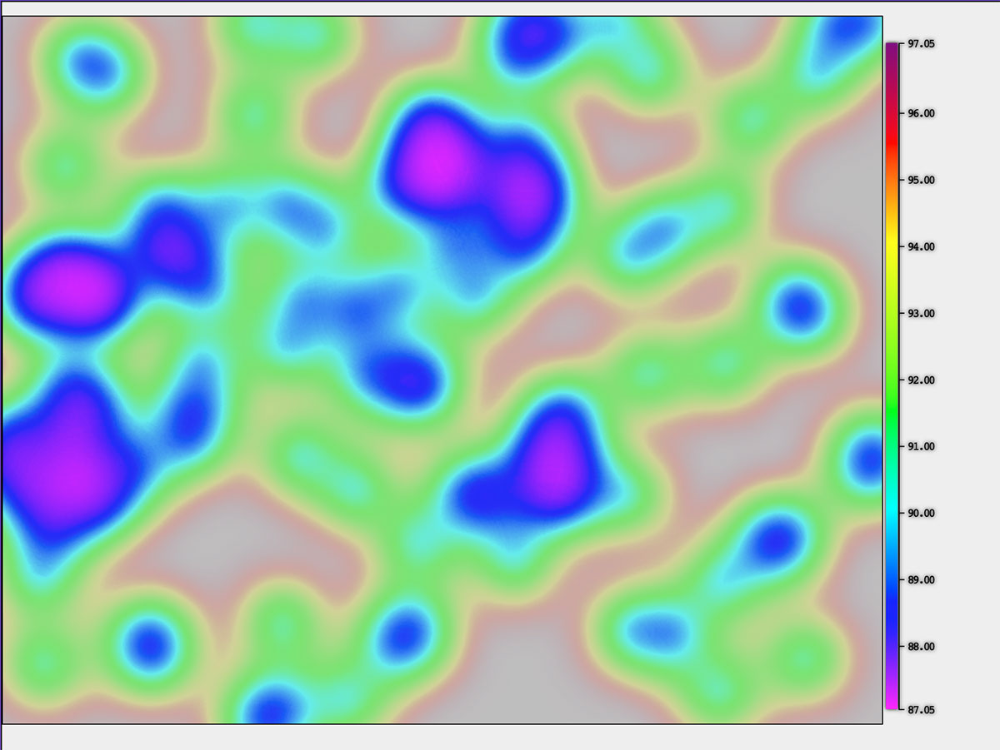
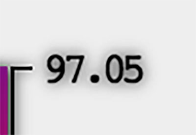
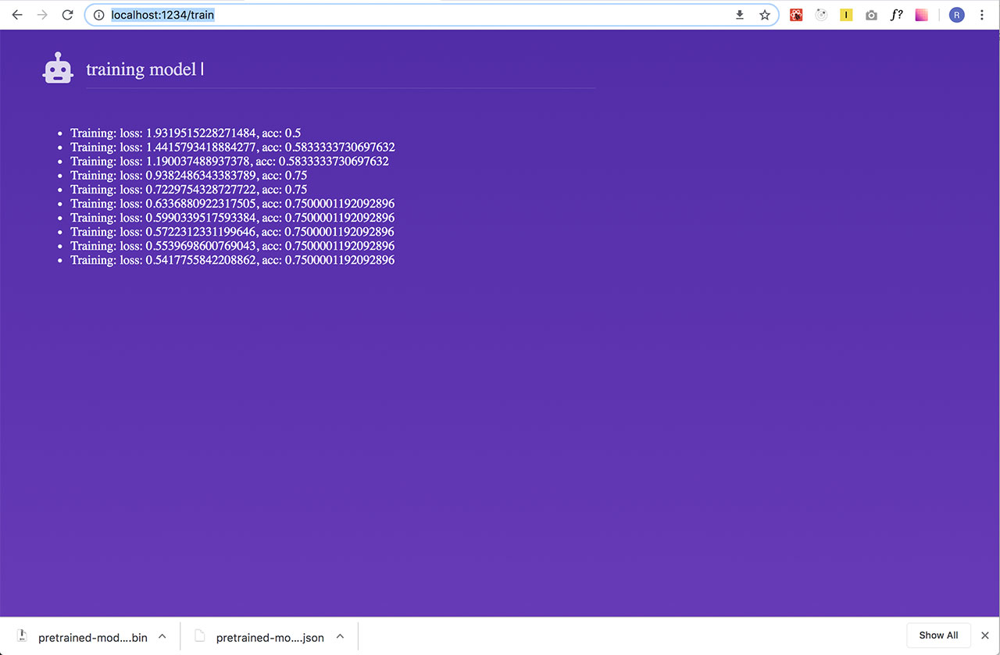
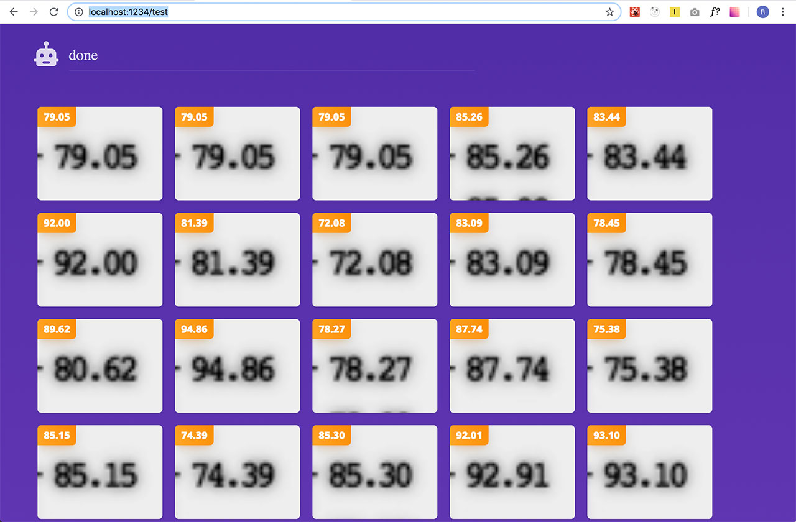
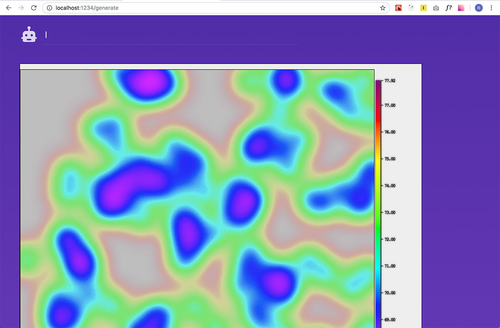

# Tensorflow.js digit recognition

A demonstration of using decapitated mobilenet for a digit recognition on the custom dataset.



We're interested in finding out top-right-most number. 



## Requirements

- node
- npm

## Installation

```
npm i
```

## Usage

Run:

```
npm run dev
```

Then open your browser and go to:

```
http://localhost:1234/train
```

After the model finishes the training, two json files should be automatically downloaded
by your browser: `pretrained-model.json` and `pretrained-model.weights.bin`. 



Move these two files into the `dist/model` folder and then go to:

```
http://localhost:1234/test
```

After a bit of waiting you should be able to see the results of the training




If you wanted to see the generator of the testing data, you can go to:

```
http://localhost:1234/generate
```




## Built With

* Tensorflow.js
* React
* Parcel

## Authors

* **Zdenek Hynek** - zdenek.hynek@gmail.com